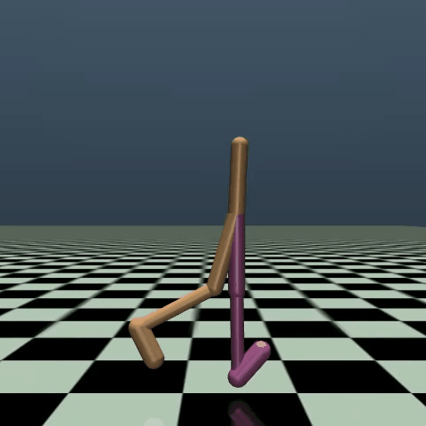
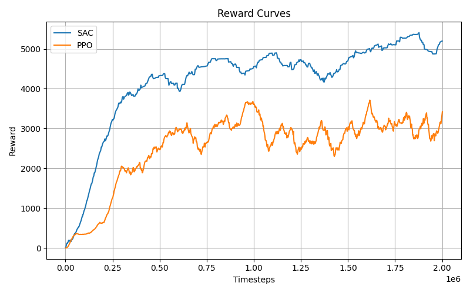
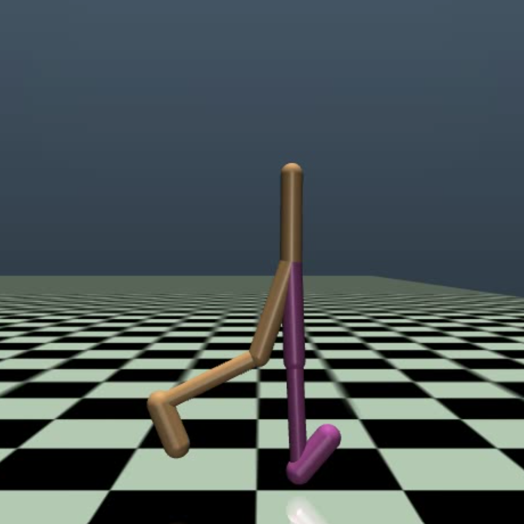

<p align="center">
  
</p>

<h1 align="center">Learning Bipedal Walking with Reinforcement Learning</h1>

<p align="center">
  Comparative Deep RL Benchmark using PPO and SAC on Continuous Control Locomotion
</p>

<p align="center">
  
  
  
  
</p>

---


This project explores how a Reinforcement Learning (RL) agent can learn to walk like a 2D robot by interacting with a simulated physics environment.

The agent receives information about its body position, joint angles, and movement, and learns to apply continuous motor actions in order to move forward without falling. Over many training steps, the agent gradually discovers stable walking behavior through trial and error.

To study how different RL methods behave on the same locomotion task, I trained and compared:

* **Proximal Policy Optimization (PPO)**
* **Soft Actor-Critic (SAC)**

---

## Implementation

* Training a bipedal robot agent using PPO and SAC, imported from StableBaselines3
* Recording reward growth and episode statistics using TensorBoard
* Saving trained models and testing final locomotion behavior
* Comparing convergence trends between PPO and SAC
---

## Environment Used

The project uses the **Walker2d** simulation environment from **Gymnasium**, using the physics simulator **MuJoCo**.

* **Observation Space:** body positions, velocities, joint states
* **Action Space:** continuous torque values for 6 joints

---

## Project Structure

```bash
walker2d-rl/
│
├── ppo_experiments/
├── sac_experiments/
├── results/
│   ├── demo_videos/
│   ├── PPO_vs_SAC_reward.png
│   ├── gait_capture.png
│   └── gait_gif.gif
│
├── requirements.txt
└── README.md

---

## How to Run

Install dependencies:

```bash id="r8k4td"
pip install -r requirements.txt
```

Train PPO:

```bash id="77j59h"
python ppo_experiments/train_ppo.py
```

Train SAC:

```bash id="d5r7vo"
python sac_experiments/train_sac.py
```

Test saved agents:

```bash id="90xg9w"
python ppo_experiments/test_ppo_save.py
python sac_experiments/test_sac_save.py
```

View TensorBoard Logs:

```bash id="90xg9w"
tensorboard --logdir=logs/ppo
tensorboard --logdir=logs/sac
```

---

## Tools and Libraries Used

* Python
* Gymnasium
* MuJoCo Physics Engine
* Stable-Baselines3
* TensorBoard
* Matplotlib
* NumPy
* OpenCV

---

## Results Snapshot

### Demo Video

- SAC and PPO Agent Demo: [View Video](results/demo_videos/SAC_vs_PPO_gait_analysis.mp4)

### PPO vs SAC Comparison

<p align="center">
  
</p>

The graph above compares cumulative reward growth for PPO and SAC during training. Both algorithms successfully learned forward locomotion, while showing noticeable differences in convergence speed and exploration behavior.

### Learned Locomotion Behavior

<p align="center">
  
</p>

Beyond numerical rewards, the final walking style of the trained agent was visually analyzed to study balance, smoothness, and gait consistency.

---

## Key Observations

* Both algorithms were able to learn forward locomotion over time.
* PPO showed stable and consistent reward improvement during training.
* SAC demonstrated stronger exploration and smoother policy adaptation in several runs.
* A good reward did not always correspond to more natural walking behavior.

---

## Author

Visha Sitapara
